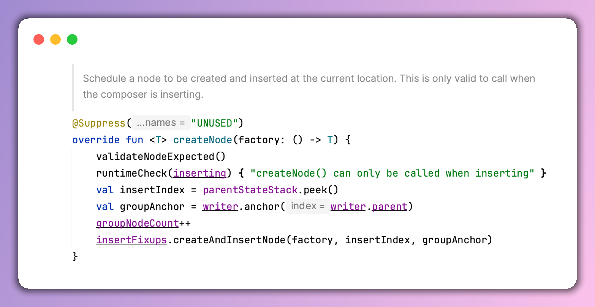
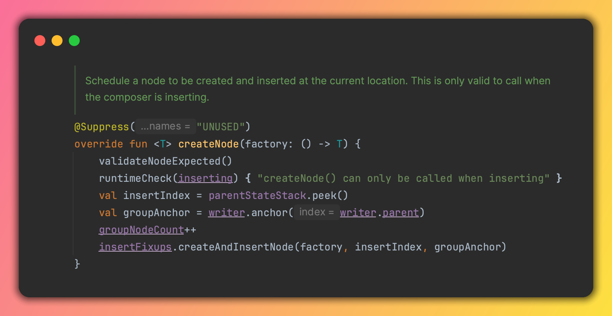

# Beautiful Code Screenshot

[](https://plugins.jetbrains.com/plugin/30537-beautiful-code-screenshot/)

An IntelliJ IDEA / Android Studio plugin that turns selected code into a stunning, shareable image — right inside your IDE.

Available on the [JetBrains Marketplace](https://plugins.jetbrains.com/plugin/30537-beautiful-code-screenshot/).

Inspired by tools like [Carbon](https://carbon.now.sh), it renders your code with full syntax highlighting, wrapped in a macOS-style window with rounded corners, drop shadow, and traffic light buttons.

## Screenshots

| Light theme | Dark theme |
|---|---|
|  |  |

## Features

- **Syntax-accurate rendering** — uses your IDE's own highlighter, so the output matches exactly what you see in the editor
- **Background presets** — transparent, 8 solid colors, or 8 beautiful gradients (violet, ice blue, emerald, golden sunset, and more)
- **Remembers your last choice** — background selection persists across sessions
- **Copy to clipboard** — paste directly into Slack, Twitter, Notion, or any tool
- **Save as PNG** — export to a file with a native save dialog
- **No external dependencies** — runs locally, no cloud, no accounts required

## Getting Started

1. Open any file in the editor
2. Select the code you want to capture
3. Right-click and choose **Make a Screenshot**
4. Pick a background from the palette at the top of the preview
5. Click **Copy to Clipboard** or **Save as PNG**

## Building

```bash
./gradlew buildPlugin
```

The output ZIP ready for upload is at `build/distributions/`.

## Tech Stack

- Kotlin
- IntelliJ Platform SDK
- Gradle IntelliJ Platform Plugin

## Credits

This plugin was built with the assistance of [Claude Code](https://claude.ai/claude-code) (Claude Sonnet 4.6 by Anthropic).
